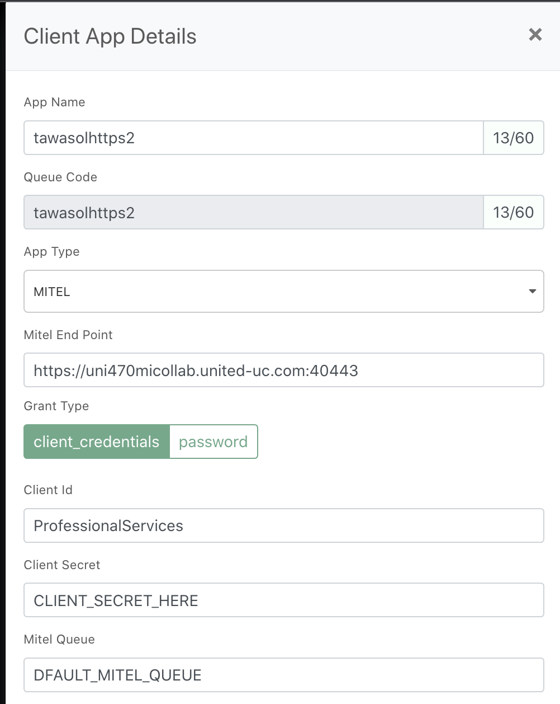

# Mitel Integration

## Prerequisite
1. MeherY Account
2. Mitel Account

## Steps
1. Open MeherY Admin Portal   <domaon>.mehery.com/admin
2. Left Sidebar - Open Client Apps
3. Create App
4. Select AppType - Mitel
5. Fill all credentials
  - 
