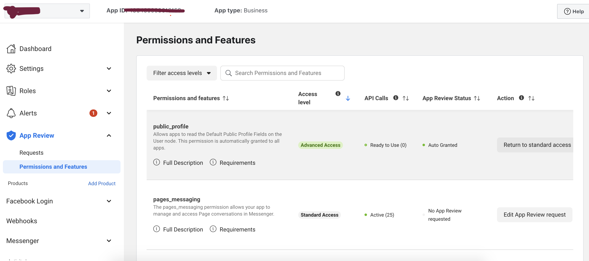
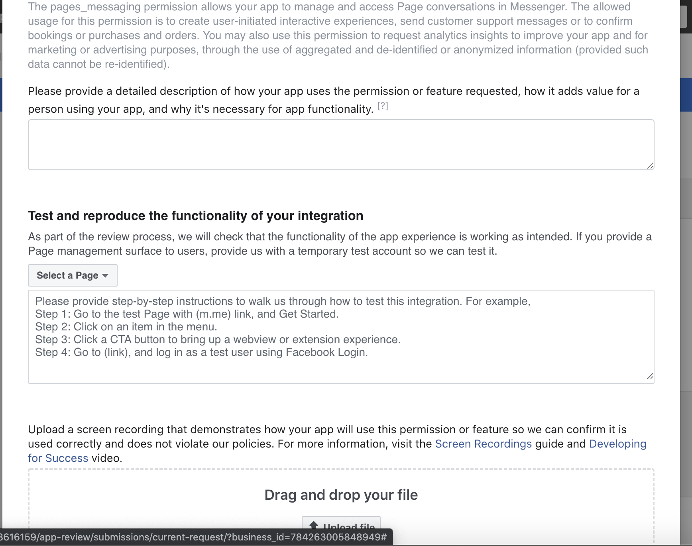

# FB Messaging Permissions

1. Login to Facebook Developer Account. [Login/Signup](https://developer.facebook.com/)
2. Select Your App
3. Go to _**App Review** &#8594; **Permissions and Features**_
  - 
4. Search _pages_messaging_
5. Click _Request Advance Access_
6. Click _Edit App Review Request_
  - 
7. Fill all necessary details. Below are few text samples for help
    
    ```text
      // Sample detailed description
      Our App lets our customers connect to us, write to use in real time,
      and inquire about bookings if they have done, 
      or new trip they want us to customise for them.
    ```
    
    ```text
      // Sample Steps
      1. Got to https://aertrip.mehery.com/
      2. Click on Facebook icon
      3. Go to messenger app opened 
      4. Say “hello”
      5. Select option if prompted or Start conversation with Our Agent, 
      6. Our Agents will reply you in 24 hours
    ```
8. Create a video for "How Customer will interact with" your Service
9. Create video for How Agent is going to respond to Customer
10. Provide Credentials if Asked.